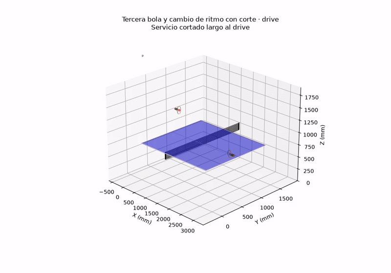

# Table Tennis Physics Simulator

Three-dimensional table tennis simulator for studying trajectories, racket impacts, serves, and returns. The project includes parameter search, legality validators, reproducible benchmarks, interactive notebooks, and MP4 export.



## Installation

Requires Python 3.10 or higher. On Windows, the installer creates the environment, installs the package, and registers the kernel with the correct absolute path:

```powershell
powershell -NoProfile -ExecutionPolicy Bypass -File .\scripts\setup_environment.ps1
```

Then select **Python (TableTennis)** in Jupyter or VS Code. Do not use the generic `Python 3` kernel: it may point to a different interpreter where the package is not installed.

Quick diagnostic:

```powershell
.\.venv\Scripts\table-tennis.exe doctor
```

The base dependency is NumPy. The available extras are:

* `search`: SciPy for global optimization and local polishing.
* `visualization`: Matplotlib for plots and animations.
* `notebooks`: JupyterLab, widgets, Matplotlib, and SciPy.
* `dev`: full environment used by tests and notebooks.

FFmpeg is an optional external dependency required to save MP4 files. It can be available in `PATH` or provided with `--ffmpeg`.

## Usage

The installed interface is `table-tennis`; it can also be used through `python -m table_tennis`.

```powershell
table-tennis --help
table-tennis simulate
table-tennis simulate --save outputs/simulation.mp4

table-tennis benchmark direct --repeat 1
table-tennis benchmark direct --video-dir outputs/benchmarks/direct
table-tennis benchmark racket --repeat 1 --no-video
table-tennis benchmark returns

table-tennis search service --mode direct --service pendulum --depth short --lane elbow
table-tennis search service --mode racket --service tomahawk --depth short --lane forehand
table-tennis search exercise --exercise falkenberg --workers 1
table-tennis search retune-all --dry-run
table-tennis search retune-all --suite direct --workers 4

table-tennis generate return-videos --dry-run
table-tennis generate return-videos --profile cut_short --overwrite
table-tennis generate benchmark-videos --suite all --dry-run
table-tennis generate benchmark-videos --suite all --workers 2
table-tennis generate exercise-videos --dry-run
table-tennis generate exercise-videos --exercise falkenberg --overwrite
table-tennis generate exercise-videos --workers 2
table-tennis generate exercise-viewer
table-tennis generate racket-viewer
```

Return generation produces videos of up to five seconds and stops earlier if the ball center falls below the floor. Use `--duration` to change the limit.

`generate benchmark-videos` manages 118 cases: 54 direct serves, 54 racket serves, and 10 returns. It checks each MP4 with FFprobe, skips valid files, regenerates corrupted files, publishes through atomic renaming, and saves the summary to `outputs/benchmarks/video_manifest.json`. Use `--overwrite` to force regeneration and `--workers` to parallelize on Windows.

The 54 direct serves and their 54 racket-based equivalents share the same low-trajectory calibration: between the first bounce on the server’s side and the first bounce on the receiver’s side, the apex may not exceed 50 mm above the net, and the first receiver-side bounce may not exceed 25 mm above it. The current calibration leaves the worst serve at 49.86 mm of flight, 3.56 mm of bounce, 5.05 mm of minimum net clearance, and 17.57 mm of bounce error.

## ACE physical model

The flight and table-contact model follow the analytical baseline published by Dürr et al. for Ace. The model uses a mass of 2.7 g, a radius of 20 mm, air density of 1.204 kg/m³, `c_d=0.55`, quadratic drag, a Magnus effect dependent on the speed/spin ratio, constant spin during flight, and RK4 integration. The bounce uses `ε=0.98-0.02·|v_z|`, with velocity in m/s, and the ACE matrix transition between sliding and rolling with `μ=0.25`.

The reference paper is versioned at:

`docs/Articles/[Dür 2026] Outplaying elite table tennis players with an Autonomous Robot.pdf`.

Racket contact deliberately preserves the existing `legacy` and `coulomb` models: the paper does not publish the fitted coefficients required to reproduce its robot–ball contact without introducing assumptions.

After changing the physical model, full recalibration is run in resumable stages:

```powershell
table-tennis search retune-all --suite direct --workers 4
table-tennis search retune-all --suite services --workers 3
table-tennis search retune-all --suite returns --workers 4
table-tennis search retune-all --suite exercises --workers 4
```

Candidates and checkpoints are stored in `outputs/search/retune/`. No partial run automatically replaces versioned presets. The promoted ACE state validates 54 direct serves, 54 racket serves, three pilot serves, ten returns, and ten exercises.

### Multi-stroke exercises

`generate exercise-videos` produces ten chained rallies: forehand–forehand, backhand–backhand, figure eights, Falkenberg, forehand and backhand hit-and-move drills, two third-ball opening drills plus hit-and-move, and third-ball drills with pace change and chop in fully forehand and fully backhand variants. Each pattern contains at least three cycles; the two continuous exercises contain ten strokes.

Normal generation loads calibrated racket controls, re-simulates and validates all segments, and only then renders them. The videos show both rackets, the current cycle, and the active stroke. Their duration is obtained from the full physical sequence, not from a fixed limit. If a number of cycles other than three is requested, the additional contacts are recalibrated deterministically.

Each racket follows a continuous Bézier track between standby, preparation, impact, follow-through, and return to standby. The neutral stance is behind the end line, centered in the backhand quadrant, with the handle pointing backward. Between two strokes by the same player, recovery and approach each take 35% of the interval; the central 30% preserves exactly that neutral stance. Position and orientation are played back at one third of the speed to avoid visual jumps without altering the physical trajectory. At impact, the handle points toward the player’s relative left for forehands and toward the player’s right for backhands.

Phases and depths are assigned centrally: continuity attack at point 3 and long; topspin opening at 15% of point 4 and long; push and block at point 2; defensive chop at point 4. A short target is placed about 300 mm from the net and must be observed within the first 450 mm. A long target is placed near the end line and must exceed 800 mm from the net. Validation checks the selected phase and the observed depth.

In addition to legality, direction, and depth, each segment limits the flight apex to 50 mm above the net and the first bounce to 25 mm above it. These limits are measured on the simulated physical events, not on the animation. The versioned controls currently leave the worst case at 49.45 mm during flight and 14.50 mm after the bounce. Playback is slowed down to one third of the physical speed to preserve smoothness with the flattest trajectories.

Main options:

* `--exercise`, repeatable, selects exercises.
* `--cycles`, with value and minimum of three, extends the pattern.
* `--workers`, `--overwrite`, `--limit`, `--fps`, and `--ffmpeg` control the batch.
* `--dry-run` lists jobs without calibrating or rendering.

The MP4 files and the manifest are saved in `outputs/exercises/`. Valid files are skipped using FFprobe, and each render is published atomically.

`search exercise` recalibrates one or more exercises and exports candidate parameters to `outputs/search/exercises/candidates.json`; it does not automatically replace versioned presets.

`generate exercise-viewer` creates:

`outputs/viewers/exercise_viewer.html`.

It is a static page with filters by family and wing, search, technical sequence, and playback of the selected MP4 with autoplay, muted audio, and loop enabled. Paths are relative: it can be opened directly without a server. When a video is missing, the viewer shows the exact command required to generate it.

## Organization

```text
src/table_tennis/
  physics.py           physics engine without interface dependencies
  models.py            conditions, impacts, results, and events
  events.py            queries and moments 1-6
  exchange.py          serve-receive exchange contract
  rally.py             bidirectional multi-stroke rallies
  validation.py        legality and tolerances
  search/              optimization of serves, returns, and exercises
  presets/             reproducible data
  benchmarks/          validation and measurement
  visualization/       drawing, animation, videos, and viewer
notebooks/             active interactive explorers
tests/                 unit and architecture tests
docs/assets/           documentation assets
archive/               unmaintained historical material
outputs/               regenerable videos, viewers, and results
```

`outputs/` is ignored by Git. The default locations are:

* `outputs/benchmarks/direct/`
* `outputs/benchmarks/racket/`
* `outputs/benchmarks/returns/`
* `outputs/exercises/`
* `outputs/search/exercises/`
* `outputs/search/retune/`
* `outputs/notebooks/<notebook>/`
* `outputs/viewers/exercise_viewer.html`
* `outputs/viewers/racket_benchmark_viewer.html`

## Python API

```python
from table_tennis import InitialConditions, simulate, simulate_exercise
from table_tennis.events import identify_trajectory_moments
from table_tennis.presets.exercises import build_exercise

result = simulate(InitialConditions())
moments = identify_trajectory_moments(result)
exercise = simulate_exercise(build_exercise("figure_eight", cycles=3))
assert exercise.passed
```

The exchange contracts are in `table_tennis.exchange`; validators are in `table_tennis.validation`; and searches are in `table_tennis.search.service` and `table_tennis.search.returns`.

## Notebooks

* `01_direct_trajectory_explorer.ipynb`: direct trajectory and presets.
* `02_racket_impact_explorer.ipynb`: impact, gesture, and contact moments.
* `03_service_parameter_search.ipynb`: search with visible progress.
* `04_serve_return_search.ipynb`: configurable serve and return.

Run the installer first and select the **Python (TableTennis)** kernel. Each notebook checks the interpreter before importing the package and explains how to fix an incorrect selection. All four include an explicit action to save and display an MP4 under their own folder in `outputs/notebooks/`.

## Migration from the old scripts

| Before                                    | Now                                   |
| ----------------------------------------- | ------------------------------------- |
| `python table_tennis_simulation.py`       | `table-tennis simulate`               |
| `python benchmark_direct_services.py`     | `table-tennis benchmark direct`       |
| `python benchmark_racket_services.py`     | `table-tennis benchmark racket`       |
| `python benchmark_returns.py`             | `table-tennis benchmark returns`      |
| `python service_parameter_search.py`      | `table-tennis search service`         |
| `python generate_return_videos.py`        | `table-tennis generate return-videos` |
| `python generate_racket_benchmark_web.py` | `table-tennis generate racket-viewer` |

The migration is intentionally immediate: the old root-level modules and scripts no longer exist.

## Verification

```powershell
.\.venv\Scripts\python.exe -m unittest discover -s tests -v
.\.venv\Scripts\python.exe scripts\validate_notebooks.py
.\.venv\Scripts\table-tennis.exe generate benchmark-videos --suite all --dry-run
.\.venv\Scripts\table-tennis.exe generate exercise-videos --dry-run
.\.venv\Scripts\table-tennis.exe benchmark returns
```

The pilot bank must keep ten legal returns, and the service benchmarks must preserve their calibrated margins, including the low-trajectory limits of 50 mm of flight and 25 mm of bounce above the net.
