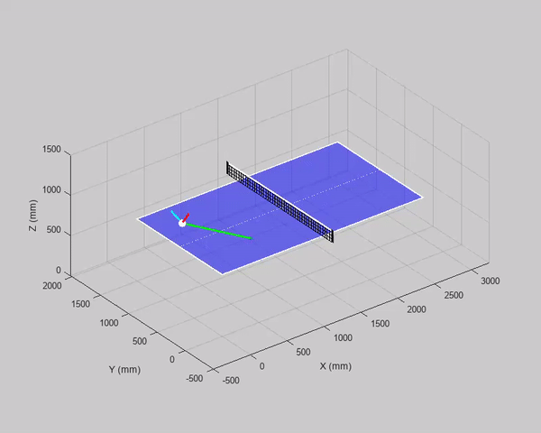

# Table Tennis Physics Simulator

Simulador tridimensional de tenis de mesa para estudiar trayectorias, impactos
con raqueta, servicios y devoluciones. El proyecto incluye búsqueda de
parámetros, validadores de legalidad, benchmarks reproducibles, notebooks
interactivos y exportación MP4.



## Instalación

Requiere Python 3.10 o superior. En Windows, el instalador crea el entorno,
instala el paquete y registra el kernel con la ruta absoluta correcta:

```powershell
powershell -NoProfile -ExecutionPolicy Bypass -File .\scripts\setup_environment.ps1
```

Después, seleccione **Python (TableTennis)** en Jupyter o VS Code. No use el
kernel genérico `Python 3`: puede apuntar a otro intérprete donde el paquete no
está instalado.

Diagnóstico rápido:

```powershell
.\.venv\Scripts\table-tennis.exe doctor
```

La dependencia base es NumPy. Los extras disponibles son:

- `search`: SciPy para optimización global y pulido local.
- `visualization`: Matplotlib para gráficos y animaciones.
- `notebooks`: JupyterLab, widgets, Matplotlib y SciPy.
- `dev`: entorno completo usado por pruebas y notebooks.

FFmpeg es una dependencia externa opcional necesaria para guardar MP4. Puede
estar en `PATH` o indicarse con `--ffmpeg`.

## Uso

La interfaz instalada es `table-tennis`; también puede usarse
`python -m table_tennis`.

```powershell
table-tennis --help
table-tennis simulate
table-tennis simulate --save outputs/simulation.mp4

table-tennis benchmark direct --repeat 1
table-tennis benchmark direct --video-dir outputs/benchmarks/direct
table-tennis benchmark racket --repeat 1 --no-video
table-tennis benchmark returns

table-tennis search service --mode direct --service pendulum --depth short --lane elbow
table-tennis search service --mode racket --service tomahawk --depth short --lane forehand
table-tennis search exercise --exercise falkenberg --workers 1

table-tennis generate return-videos --dry-run
table-tennis generate return-videos --profile cut_short --overwrite
table-tennis generate benchmark-videos --suite all --dry-run
table-tennis generate benchmark-videos --suite all --workers 2
table-tennis generate exercise-videos --dry-run
table-tennis generate exercise-videos --exercise falkenberg --overwrite
table-tennis generate exercise-videos --workers 2
table-tennis generate racket-viewer
```

La generación de devoluciones produce videos de hasta cinco segundos y se
detiene antes si el centro de la bola cae por debajo del piso. Use
`--duration` para cambiar el límite.

`generate benchmark-videos` administra 118 casos: 54 directos, 54 con raqueta
y 10 devoluciones. Verifica cada MP4 con FFprobe, omite archivos válidos,
regenera archivos corruptos, publica mediante renombrado atómico y guarda el
resumen en `outputs/benchmarks/video_manifest.json`. Use `--overwrite` para
forzar la regeneración y `--workers` para paralelizar en Windows.

### Ejercicios multigolpe

`generate exercise-videos` produce diez rallies encadenados: drive–drive,
revés–revés, ochos, Falkenberg, pega pasa de drive y revés, dos aperturas de
tercera bola más pega pasa, y tercera bola con cambio de ritmo y corte en
variantes íntegramente de drive y de revés. Cada patrón contiene al menos tres
vueltas; los dos ejercicios continuos contienen diez golpes.

La generación normal carga controles de raqueta calibrados, vuelve a simular y
validar todos los segmentos y solo entonces renderiza. Los videos muestran
ambas raquetas, la vuelta y el golpe activo. Su duración se obtiene de la
secuencia física completa, no de un límite fijo. Si se solicita un número de
vueltas distinto de tres, los contactos adicionales se recalibran de forma
determinista.

Cada raqueta sigue una pista Bézier continua entre stand by, preparación,
impacto, final de ejecución y regreso al stand by. La postura neutral queda
detrás de la línea de fondo, en el centro del cuadrante de revés, con el mango
apuntando hacia atrás. Posición y orientación se reproducen a media velocidad
para evitar saltos visuales sin alterar la trayectoria física. En el impacto,
el mango apunta hacia la izquierda relativa del jugador para el drive y hacia
su derecha para el revés.

Opciones principales:

- `--exercise`, repetible, selecciona ejercicios.
- `--cycles`, con valor y mínimo de tres, amplía el patrón.
- `--workers`, `--overwrite`, `--limit`, `--fps` y `--ffmpeg` controlan el lote.
- `--dry-run` enumera trabajos sin calibrar ni renderizar.

Los MP4 y el manifiesto se guardan en `outputs/exercises/`. Los archivos
válidos se omiten mediante FFprobe y cada render se publica atómicamente.
`search exercise` vuelve a calibrar uno o varios ejercicios y exporta los
parámetros candidatos a `outputs/search/exercises/candidates.json`; no
reemplaza automáticamente los presets versionados.

## Organización

```text
src/table_tennis/
  physics.py           motor físico sin dependencias de interfaz
  models.py            condiciones, impactos, resultados y eventos
  events.py            consultas y momentos 1-6
  exchange.py          contrato del intercambio servicio-recepción
  rally.py             rallies multigolpe bidireccionales
  validation.py        legalidad y tolerancias
  search/              optimización de servicios, devoluciones y ejercicios
  presets/             datos reproducibles
  benchmarks/          validación y medición
  visualization/       dibujo, animación, videos y visor
notebooks/             exploradores interactivos activos
tests/                 pruebas unitarias y de arquitectura
docs/assets/           recursos de documentación
archive/               material histórico no mantenido
outputs/               videos, visores y resultados regenerables
```

`outputs/` está ignorado por Git. Las ubicaciones predeterminadas son:

- `outputs/benchmarks/direct/`
- `outputs/benchmarks/racket/`
- `outputs/benchmarks/returns/`
- `outputs/exercises/`
- `outputs/search/exercises/`
- `outputs/notebooks/<notebook>/`
- `outputs/viewers/racket_benchmark_viewer.html`

## API Python

```python
from table_tennis import InitialConditions, simulate, simulate_exercise
from table_tennis.events import identify_trajectory_moments
from table_tennis.presets.exercises import build_exercise

result = simulate(InitialConditions())
moments = identify_trajectory_moments(result)
exercise = simulate_exercise(build_exercise("figure_eight", cycles=3))
assert exercise.passed
```

Los contratos del intercambio están en `table_tennis.exchange`; los
validadores en `table_tennis.validation`; y las búsquedas en
`table_tennis.search.service` y `table_tennis.search.returns`.

## Notebooks

- `01_direct_trajectory_explorer.ipynb`: trayectoria directa y presets.
- `02_racket_impact_explorer.ipynb`: impacto, gesto y momentos de contacto.
- `03_service_parameter_search.ipynb`: búsqueda con progreso visible.
- `04_serve_return_search.ipynb`: servicio y devolución configurables.

Ejecute primero el instalador y seleccione el kernel **Python
(TableTennis)**. Cada notebook comprueba el intérprete antes de importar el
paquete y explica cómo reparar una selección incorrecta. Los cuatro incluyen
una acción explícita para guardar y mostrar un MP4 bajo su propia carpeta en
`outputs/notebooks/`.

## Migración desde los scripts antiguos

| Antes | Ahora |
|---|---|
| `python table_tennis_simulation.py` | `table-tennis simulate` |
| `python benchmark_direct_services.py` | `table-tennis benchmark direct` |
| `python benchmark_racket_services.py` | `table-tennis benchmark racket` |
| `python benchmark_returns.py` | `table-tennis benchmark returns` |
| `python service_parameter_search.py` | `table-tennis search service` |
| `python generate_return_videos.py` | `table-tennis generate return-videos` |
| `python generate_racket_benchmark_web.py` | `table-tennis generate racket-viewer` |

La migración es intencionalmente inmediata: los módulos y scripts antiguos de
la raíz ya no existen.

## Verificación

```powershell
.\.venv\Scripts\python.exe -m unittest discover -s tests -v
.\.venv\Scripts\python.exe scripts\validate_notebooks.py
.\.venv\Scripts\table-tennis.exe generate benchmark-videos --suite all --dry-run
.\.venv\Scripts\table-tennis.exe generate exercise-videos --dry-run
.\.venv\Scripts\table-tennis.exe benchmark returns
```

El banco piloto debe mantener diez devoluciones legales y los benchmarks de
servicio deben conservar sus márgenes calibrados.
